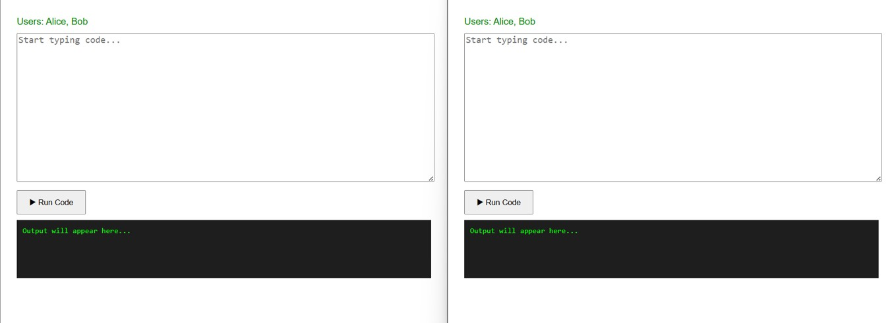
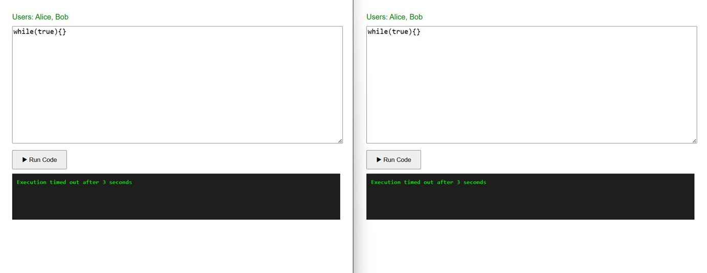
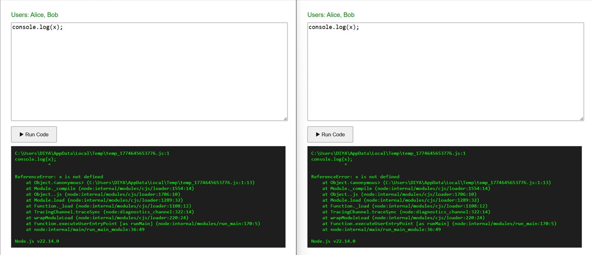

# Real-Time Collaborative Coding Platform

A scalable real-time coding platform that enables multiple users to join shared rooms, collaborate on code simultaneously, and execute programs securely with controlled concurrency and live output synchronization.

---

##  Highlights

- Real-time collaboration using WebSockets (Socket.IO)
- Room-based multi-user architecture
- Secure and isolated code execution using child processes
- FIFO queue system for managing concurrent execution requests
- Per-user execution limits to ensure fair resource usage
- Live output broadcasting to all participants
- Modular backend architecture designed for scalability

---

##  Features

- Live code editing and synchronization across multiple users
- Multi-user collaboration via unique room IDs
- Real-time code execution with shared output
- Execution sandboxing with timeouts and safeguards
- Queue-based concurrency control (FIFO scheduling)
- Fair usage policy with per-user execution limits
- Real-time execution status updates
- Clean and modular backend structure

---

##  Architecture Overview

Client (Frontend) 
↓ 
WebSocket Layer (Socket.IO) 
↓ 
Room Manager (Session Handling) 
↓ 
Execution Queue (FIFO) 
↓ 
Worker Process (Child Process) 
↓ 
Output Broadcast to Clients

---

##  How It Works

1. Users join a shared room using a unique room ID  
2. Code changes are instantly synchronized across all connected clients via WebSockets  
3. When a user executes code:
   - The request is added to a FIFO execution queue  
   - The system ensures controlled concurrency and fair scheduling  
4. Code is executed in an isolated child process  
5. Execution output is captured and broadcast to all users in the room  
6. Timeouts and safeguards prevent infinite loops and misuse  

---

##  Demo / Screenshots

###  Real-Time Code Synchronization
Multiple users can edit code simultaneously with instant updates across all connected clients.

---

### ⏱️ Execution Timeout Handling
Prevents crashes by safely terminating long-running or infinite loops using execution time limits.

---

###  Runtime Error Handling
Captures runtime errors and broadcasts them to all users in the session in real-time.

---

##  Key Design Decisions

- **FIFO Queue System**  
  Ensures fair and ordered execution while preventing server overload  

- **Child Process Execution**  
  Provides isolation from the main server, improving stability and security  

- **Execution Constraints**  
  Timeouts and limits prevent infinite loops and resource abuse  

- **Room-Based Architecture**  
  Enables scalable and independent multi-user collaboration sessions  

- **Concurrency Control**  
  Restricts simultaneous executions per user to maintain system fairness  

---

##  Tech Stack

- **Backend:** Node.js, Express.js  
- **Real-Time Communication:** Socket.IO  
- **Execution Engine:** Node.js Child Processes  
- **Architecture:** Modular (MVC-inspired)  
- **Optional:** MongoDB (for persistence)

---

##  Installation

git clone https://github.com/Ddia05/code-collab-platform

cd code-collab-platform

npm install
